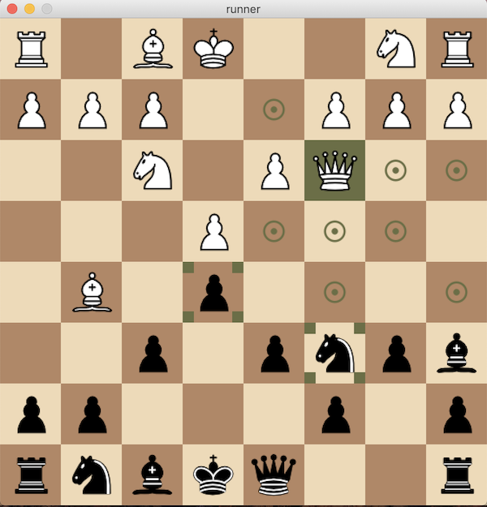

# Chess Game

Chess program for Python3 (*Player versus Player*) using [processing.py](https://py.processing.org/).

## Getting Started

### Prerequisites

**Java SE 8**

You can download Java JDK from [here](https://www.oracle.com/technetwork/java/javase/downloads/index.html). Please note that it won't work on Java 11.0.1. Ensure that you can run Java by typing the following on the command line:

```
$ java -v
```

You should see some output that looks like this:

```
java version "1.8.0_92"
Java(TM) SE Runtime Environment (build 1.8.0_92-b14)
Java HotSpot(TM) 64-Bit Server VM (build 25.92-b14, mixed mode)
```
**Processing.py**

You'll also need to obtain the standalone version of Processing.py. Choose the appropriate link according to your platform:

* [Mac OS X](http://py.processing.org/processing.py-macosx.tgz)
* Windows: [64-bit](http://py.processing.org/processing.py-windows64.zip), [32-bit](http://py.processing.org/processing.py-windows32.zip)
* Linux: [64-bit](http://py.processing.org/processing.py-linux64.tgz) [32-bit](http://py.processing.org/processing.py-linux32.tgz)

These files contain the processing.py **.jar** file along with some example scripts that you will not use. Decompress the file and move the **processing-py.jar** file (and **only** this one) to your **python-chessgame directory**. 

*Note: the **processing-py.jar** file contains all of processing.py along with a little bit of code that reads and executes the python file specified on the command line.*

Now, from the **python-chessgame directory**, type the following on the command line:

### Start playing

```
java -jar processing-py.jar runner.py
```

A window will appear with the board displayed and running. White goes first :wink:

## Screenshots




## Authors

* **Theo Avoyne** - [theoavoyne](https://github.com/theoavoyne)

